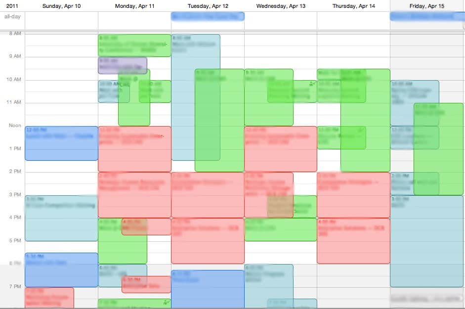

## The Problem
Every semester, students face the challenge of planning their academic schedules under tight constraints. Course availability is often limited, with only a few seats offered relative to student demand. On top of that, students must navigate personal time constraints, work schedules, extracurricular commitments, and the need to meet major or graduation requirements.
The current scheduling process is frustrating and time-consuming. Students may spend hours reviewing course offerings, only to have their ideal classes fill up before their registration period opens. Even after registering, changes in course availability often force them to restart the process. Additionally, students may wish to avoid certain instructors or find classes that align with friends’ schedules, adding more complexity and stress.

## The Solution
Schedule Assistant is a web-based tool designed to simplify and streamline the class registration experience. By allowing students to input their availability, course preferences, graduation requirements, and other personal constraints, the system generates a list of optimal class schedules. The app prioritizes open classes, filters based on requirements, and even suggests compatible schedules with friends—helping students save time, reduce stress, and stay on track for graduation.

## Approach
The system will follow a user-centered approach by collecting inputs such as:
* Availability (preferred class times/days)
* Course requirements (major, GE, minor, etc.)
* Instructor preferences (exclude/include certain instructors)
* Preferred schedule style (e.g., compact schedule, free Fridays, early/late classes)
* Career or interest focus (optional AI-powered elective suggestions)
* Desired classmates (optional friend-matching)
* Preferred learning mode: Online, in-person, hybrid options
Class difficulty level: User preference for easier or more challenging professors based on past student reviews

Based on these inputs, Schedule Assistant will:

* Pull real-time class data, graduation requirements, and class history from the school’s registration system (e.g., Star GPS)
* Filter courses based on current availability, user preferences, and requirement coverage
* Check course prerequisites and ensure classes fulfill graduation goals
* Generate multiple optimized schedule options, ranked by user-defined priorities
* Allow users to save, compare, export, and share schedules
* Sync with productivity apps like Google Calendar, Outlook, or mobile reminders
* Offer insights on time management, suggesting study sessions based on free periods
* Notify users if a preferred class is full and suggest alternatives or waitlist options

 
## Mockup Page Ideas
### Landing / Login Page
* User logs in and links their Star GPS account
* Optional intro walkthrough for first-time users
### Dashboard
* Overview of saved schedules
* Notifications if selected classes become full or open
* Quick links to generate new schedules
### Availability Page
* Interactive weekly calendar for blocking off unavailable times
* Advanced filters (earliest start time, latest end time, break preferences, etc.)
### Course Filter Page
* Filter by department, course type (GE, major, elective), instructor, credits
* Option to mark must-have or avoid courses
* Indicator of workload intensity based on student feedback.
### Schedule Suggestions Page
* Show several optimal schedules based on current inputs
* Allow comparisons between options (side-by-side or stacked)
* Show which graduation requirements are satisfied in each schedule
### (Optional) Friend Match Page
* Sync with friends (via email or school ID)
* Highlight overlapping class sections or suggest shared options
* Study group formation and shared schedule planning.
### (Optional) Elective Recommendation Page
* Use AI to suggest electives based on student interests or career paths
* Link to course descriptions and student reviews
* Predictive analysis of elective impact on future career opportunities.

##  Use Case Scenario: Student Workflow  

1. A student visits the landing page and logs in via Star GPS  
2. The system automatically pulls their class history and remaining graduation requirements  
3. They go to the Availability Page and select preferred times/days for classes  
4. Then, they navigate to the Course Filter Page to apply filters (e.g., "only upper-division CS classes", "avoid Dr. Smith", "must take Ethics")  
5. Schedule Assistant generates several optimized schedules based on:  
   * Availability  
   * Graduation progress  
   * Real-time course availability  
6. The student explores the Schedule Suggestions Page, compares results, and saves their top choices  
7. If desired, they visit the Friend Match Page to coordinate with friends or use the Elective Recommendation Page to find electives aligned with future goals  
8.  Once satisfied, they export or save the chosen schedule for their actual registration day  

## Beyond the Basics  
Future improvements and features could include:  

* Real-time enrollment updates: Notify users when classes fill or become available again  
* Mobile app integration: View, adjust, or receive schedule notifications on mobile  
* AI schedule optimizer: Rank schedules by professor quality, free time, or custom user preferences  
* Elective career mapping: Use past academic behavior + goals to recommend fitting electives  
* Registration countdown/alerts: Notify users when their registration window opens  
* Class suggestions: Suggest alternative classes if a chosen one is unavailable  
* Integrated course reviews and ratings: Students can view professor ratings and feedback  

## Conclusion
This project will allow students to have a stress free registration period where they won’t have to scramble to find what it is they can and cannot register for on the day that registration opens, eliminating something that can make already difficult decisions even more challenging.
