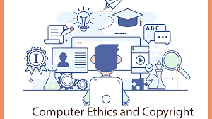

  I've never not been into technology. Some of my earliest memories consist of me playing games on my family computer before i even knew what the letters on the keyboard meant, and as I have grown I have only become more interested in the technology around me, but in that time I have also seen more and more that there are more risks then I knew popping up as we progress ever forward.

While I feel that technology has unequivocally done more good than harm for humanity in the past 20 years, allowing for amazing advancements in medicine and communication that would have been thought impossible just 100 years ago, I also cannot deny that I've seen people who lives have been ruined because the reach of technology has been left unchecked in recent years. I believe that it is the responsibilty of those who develop this technology to make sure that this is avoided in the future, or all the benefits that we've seen in recent decades may end up paling in comparison to the harms.

## On the Individual

While Social Media certainly allows for unparralled access to communication for people of all ages, it has also served to greatly harm young people, specifically teenagers. I've seen personally, and many study have shown that prolific use of social media correlates very strongly with the development of mental illness in teens and young adults. If we want this extremely powerful tool to help solve lonliness instead of causing it, we have to push for reform that doesn't pray on the fragile psychology of young children in order to create addicts.

## On Society
The biggest point of conversation in the computer world right now is Generative AI, and rightly so. It has huge practical applications in almost every field, of which medicine and communication seem the most impactful to me. But while there are many reasons to be excited about its use, i feel the excitment for its possibilties have left us under representing the cost. According to the Washington Post, it takes approximately one bottle of water to write a 100 word email using chatGPT, and while they may not seem like a large amount, the sheer volume of queries entered into it results in a gigantic toll on the amount of water we use daily. If we want to not waste the numerous benefits of AI, we need to focus on making it better for the environment, not more cost efficient.

## Finally
It is the responsibilty of those in the tech field to make sure that the progress we a pushing for is actually progress, and not actually negatively impacting the world more than it is helping. It will be hard, but it takes a conserted effort from all involved to make change, so if you are not fighting for it, you are fighting against it. I hope that in 50 years we will look back and reflect on the benefits from 2020s technology and not the donwsides.

